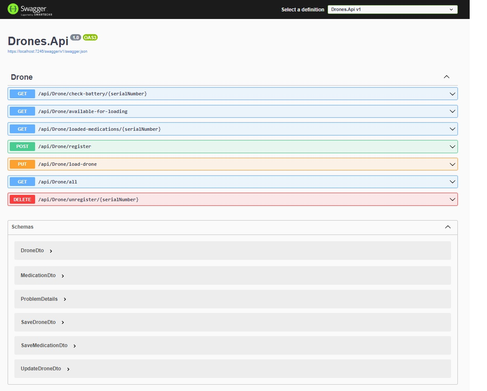

# Objective

This sample project is for manage Drones.

# Brief

This project storing information in local database about these Drones and their medications.
No more that 10 drones are allowed to register.

# Technology

Programming language: C# 

Framework: ASP.NET Core 6

Database: MSSQL Server

#Requirements

Registering a drone

Loading a drone with medication items

Checking loaded medication items for a given drone

Checking available drones for loading

Check drone battery level for a given drone

List all Drones registered (feature for testing purpose)

Unregister a drone (feature for testing purpose)

Using BackgroundServices class, that allows you to have code running in the background, there is a periodic task that checks the battery levels of the drones and saves in log, using Serilog, the information of how many drones have a percentage below 25%.

# Installation

Run: `dotnet build`  to build a project and all of its dependencies.

Run: `Update-Database -Project Drones` in Package-Manager

Run: `dotnet run --project .\Drones\Drones.Api.csproj` to run source code

Run: `dotnet test` to execute unit test

In appsettings.json are parameters with ConnectionStrings and SeriLog configuration

For testing endpoints you can open your browser and access to: https://localhost:7246/swagger/index.html

In Database folder there is a local mdf database with somo test data.

### Swagger Endpoints

